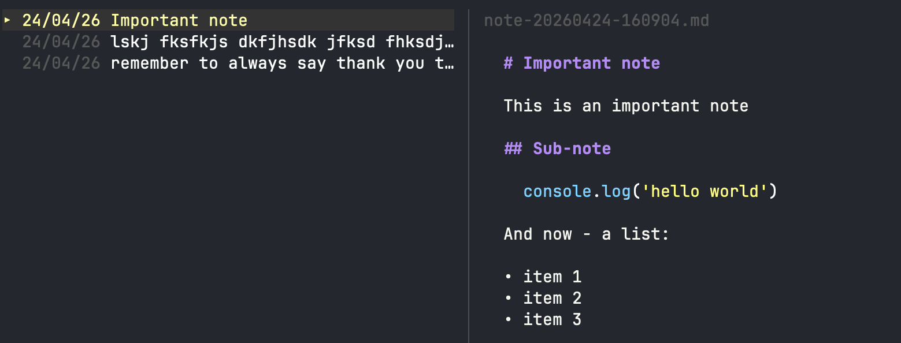

# note

A quick in-and-out terminal note-taking app. fzf-style list with live preview, markdown rendering, and a one-shot mode for when you just need to jot something down before you forget.



## What it does

Keeps a pile of small markdown notes in a per-OS config directory and gives you a keyboard-driven TUI to browse, search, preview, and manage them. Notes are plain `.md` files sorted by modification time, so the most recent is always under the cursor when you open the app. The preview pane renders markdown through [glamour](https://github.com/charmbracelet/glamour), code blocks and all.

There's also a one-shot mode for when you just want to dump a thought and get back to what you were doing:

```sh
note remember to look into glamour for markdown rendering
```

## Prerequisites

- Go 1.24 or later
- A terminal that handles 256 colours (most do)
- `$EDITOR` set to something sensible (falls back to `vi`) if you want to create notes from inside the TUI

## Install

### Pre-built binary

Grab the right binary for your platform from the [releases page](https://github.com/ohnotnow/note/releases), drop it somewhere on your `$PATH`, and make sure it's executable. On macOS and Linux:

```sh
chmod +x note-<os>-<arch>
mv note-<os>-<arch> /usr/local/bin/note
```

### From source

```sh
git clone git@github.com:ohnotnow/note.git
cd note
go install .
```

That drops a `note` binary into `$GOBIN` (usually `~/go/bin`). Make sure that directory is on your `$PATH` and you're away.

## Usage

Run `note` with no arguments to open the TUI. Pass any words as arguments to save a note immediately and exit.

### Keybindings

**List view**

| Key | Action |
|-----|--------|
| `↑` `↓` (or `j` `k`) | Move cursor |
| `g` / `G` | Jump to top / bottom |
| `enter` / `space` | Expand the selected note to the full terminal |
| `n` | Create a new note in `$EDITOR` |
| `c` | Copy the selected note to the clipboard |
| `e` | Export the selected note to a file |
| `d` / `backspace` | Delete the selected note (with confirmation) |
| `/` | Enter search mode |
| `q` / `esc` | Quit (or clear the filter if one is active) |

**Search mode**

Type to filter notes by content (case-insensitive substring match across the whole body). `↑`/`↓` still move the cursor while you're typing. `enter` or `esc` drops you back into list navigation with the filter still applied.

**Expanded view**

| Key | Action |
|-----|--------|
| `q` / `esc` | Back to the list |
| `↑` `↓` / `pgup` `pgdn` | Scroll |
| `c` | Copy this note to the clipboard |

## Where your notes live

Notes are stored as individual `.md` files in the standard per-OS config directory, via Go's `os.UserConfigDir()`:

- **macOS**: `~/Library/Application Support/note/notes/`
- **Linux**: `$XDG_CONFIG_HOME/note/notes/` (or `~/.config/note/notes/`)
- **Windows**: `%AppData%\note\notes\`

Filenames look like `note-20260424-160904.md`. Not pretty in `ls`, but easy to grep and fine to open in any editor.

## Contributing

It's a small personal project but patches are welcome. Fork, clone, `go build -o note .`, poke at it. No tests yet; the whole thing is small enough to drive manually.

## Licence

MIT. See [LICENSE](LICENSE).
